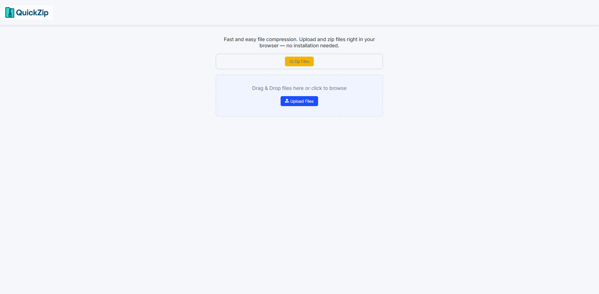
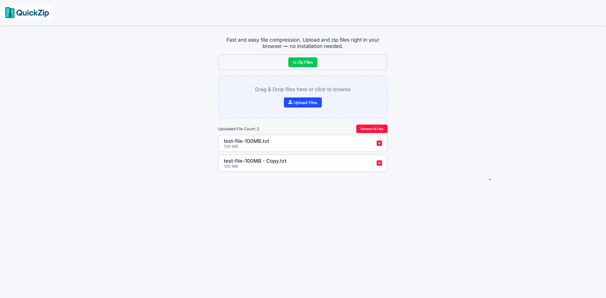
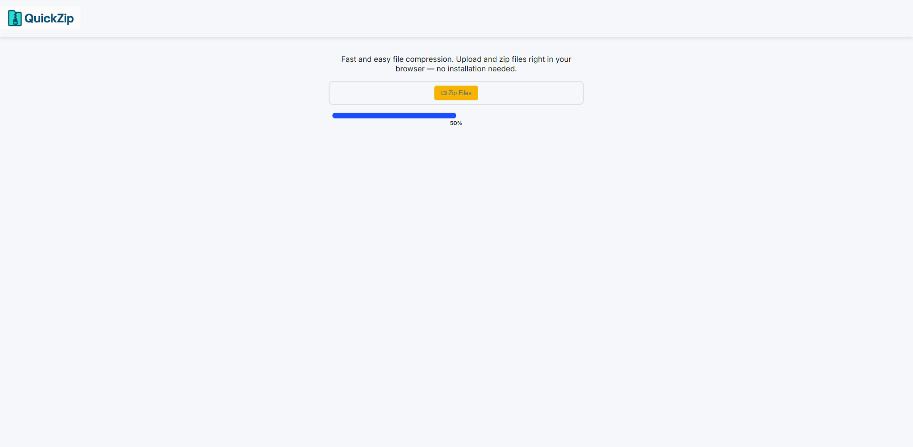
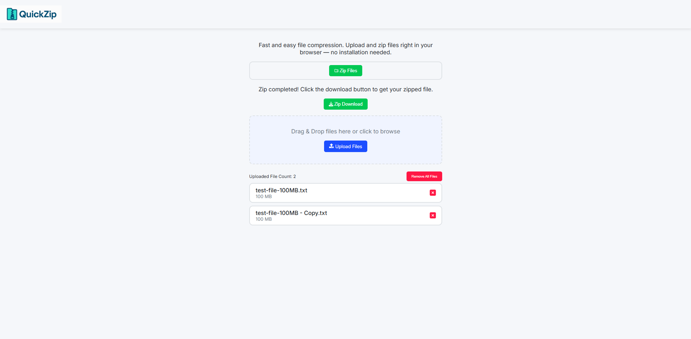

  

# QuickZip

## Table of Contents

- [Overview](#overview)
- [Features](#features)
- [Screenshots](#screenshots)
- [Technologies Used](#technologies-used)
- [How It Works](#how-it-works)
- [Installation](#installation)
- [License](#license)

## Overview

**QuickZip** is a user-friendly web application that allows users to upload multiple files, and download them as a single ZIP archive.

This project was created as part of a personal learning initiative and frontend experimentation. It allowed me to explore advanced browser APIs, ZIP file handling in JavaScript, and file input UX—all within a modern React development environment. QuickZip reflects my continued effort to build functional, user-centric tools while sharpening my frontend development skills.
---

## Features

- 📁 **Upload Files and Folders**  
  Drag-and-drop or select files and folders with ease. Supports recursive directory uploads.

- ⚡ **ZIP Creation**  
  Quickly compresses uploaded content into a downloadable archive using client-side processing.

- 💡 **Clean UI**  
  Simple, intuitive interface built with React, perfect for both technical and non-technical users.

- 🌐 **Browser-Based**  
  No installation required. Everything runs in the browser—secure and fast.

---

## Screenshots

- **Upload Interface**  
  

- **Files Uploaded**  
  

- **Zip In Progress**  
  

- **Download ZIP**  
  

---

## Technologies Used

**Frontend:**

- React.js (Vite)
- HTML5 / CSS3
- JavaScript (ES6+)

**Libraries & Tools:**

- JSZip – for ZIP file generation
- File System Access API (optional, Chrome-based)
- React Icons
- Git

---

## How It Works

1. User selects or drops files/folders into the interface.
2. Files are read and parsed, including nested directories.
3. JSZip constructs a virtual archive maintaining folder structure.
4. The archive is offered to the user for download as a `.zip` file.

> ✅ Currently supports Chrome browsers for folder uploads using the File System Access API.
